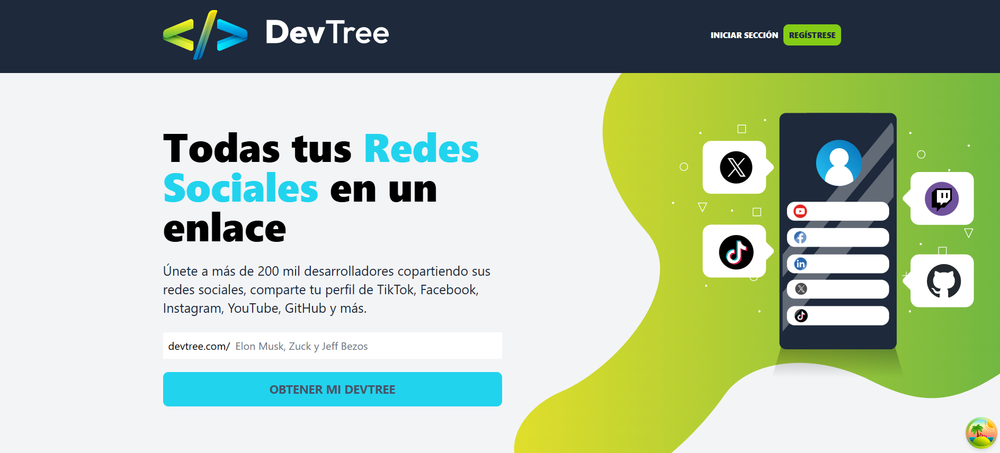

# FrontEnd DevTree ✨

 <!-- Asumiendo que 'logo.svg' es el logo principal del proyecto. -->

## Descripción del Proyecto 🚀

FrontEnd DevTree es una aplicación web moderna y dinámica diseñada para ayudar a desarrolladores, creadores de contenido y profesionales a consolidar y presentar su presencia online de manera efectiva. Inspirado en el concepto de "link tree", este proyecto permite a los usuarios crear una página centralizada donde pueden agrupar todos sus enlaces importantes, como perfiles de redes sociales, repositorios de código, portafolios y sitios web personales. Construido con un stack tecnológico robusto que incluye React, TypeScript, Tanstack Query y Tailwind CSS, DevTree ofrece una experiencia de usuario fluida, un diseño responsivo y una arquitectura modular para facilitar su mantenimiento y escalabilidad.

## Características Principales 🌟

*   **Autenticación de Usuarios:** 🔐 Registro y login seguro para gestionar tu perfil y enlaces de forma privada.
*   **Gestión de Perfil:** 👤 Personaliza tu información, foto de perfil y presenta tu mejor versión profesional.
*   **Creación y Gestión de Enlaces:** 🔗 Añade, edita, reordena y elimina tus enlaces a diferentes plataformas con facilidad.
*   **Interfaz de Usuario Intuitiva:** ✨ Navegación sencilla y diseño limpio para una experiencia de usuario óptima.
*   **Diseño Responsivo:** 📱 Adaptabilidad completa a diferentes tamaños de pantalla (móvil, tablet, escritorio) gracias a Tailwind CSS.
*   **Integración con API Backend:** 📡 Comunicación eficiente con un backend para la persistencia y gestión de datos.
*   **Tipado Estático:** 🛡️ Desarrollado con TypeScript para una mayor robustez, seguridad y facilidad de mantenimiento del código.
*   **Arquitectura Modular:** 🏗️ Código organizado en componentes, layouts y vistas para una clara separación de responsabilidades.

## Tecnologías Utilizadas 🛠️

*   **Frontend Framework:** [React](https://react.dev/)
*   **Lenguaje de Programación:** [TypeScript](https://www.typescriptlang.org/)
*   **Gestión de Estado/Data Fetching:** [Tanstack Query](https://tanstack.com/query/latest)
*   **Enrutamiento:** [React Router DOM](https://reactrouter.com/en/main)
*   **Estilado:** [Tailwind CSS](https://tailwindcss.com/)
*   **Herramienta de Construcción (Build Tool):** [Vite](https://vitejs.dev/)
*   **Cliente HTTP:** [Axios](https://axios-http.com/)
*   **Linting:** [ESLint](https://eslint.org/)

## Requisitos Previos 📋

Antes de comenzar, asegúrate de tener instalado lo siguiente en tu entorno de desarrollo:

*   [Node.js](https://nodejs.org/en/) (versión 18 o superior recomendada)
*   [npm](https://www.npmjs.com/) o [Yarn](https://yarnpkg.com/) (gestor de paquetes)

## Instrucciones de Instalación ⚙️

Sigue estos pasos para configurar y ejecutar el proyecto localmente:

1.  **Clona el repositorio:**
    ```bash
    git clone https://github.com/alejav0240/Devtree-Frontend.git # Reemplaza con la URL real de tu repositorio
    cd Devtree-Frontend
    ```

2.  **Instala las dependencias:**
    ```bash
    npm install
    # o si usas Yarn
    # yarn install
    ```

3.  **Configura las variables de entorno:**
    Crea un archivo `.env` en la raíz del proyecto. Puedes basarte en el archivo `.env.example`.
    Añade las variables necesarias, como la URL de tu API backend:
    ```
    VITE_API_BASE_URL=http://localhost:3000/api # URL de tu API backend
    ```

4.  **Inicia el servidor de desarrollo:**
    ```bash
    npm run dev
    # o si usas Yarn
    # yarn dev
    ```
    La aplicación estará disponible en `http://localhost:5173` (o el puerto que configure Vite).

5.  **Construye para producción (opcional):**
    ```bash
    npm run build
    # o si usas Yarn
    # yarn build
    ```
    Esto generará los archivos estáticos optimizados en la carpeta `dist/`, listos para ser desplegados.

## Guía de Uso 🚀

### Registro e Inicio de Sesión

1.  Al acceder a la aplicación en tu navegador, serás dirigido a la página de inicio.
2.  Haz clic en "Registrarse" para crear una nueva cuenta o "Iniciar Sesión" si ya tienes credenciales.
3.  Una vez autenticado exitosamente, accederás a tu panel de control personal.

### Gestión de Enlaces

1.  En tu panel de control, encontrarás una sección dedicada a la gestión de enlaces.
2.  Utiliza la interfaz para añadir nuevos enlaces, introduciendo un título descriptivo y la URL de destino.
3.  Podrás reordenar, editar o eliminar tus enlaces en cualquier momento, y los cambios se reflejarán instantáneamente en tu DevTree público.

### Visualización de tu DevTree

*   Comparte la URL de tu perfil público (por ejemplo, `http://localhost:5173/usuario/tu-nombre-de-usuario`) para que otros puedan ver todos tus enlaces consolidados en una única y atractiva página.

## Estructura del Proyecto 📂
```
Devtree-Frontend/
├── public/                     # Archivos estáticos (imágenes, favicons, etc.)
│   ├── social/                 # Iconos de redes sociales para los enlaces
│   └── ...
├── src/                        # Código fuente de la aplicación
│   ├── api/                    # Definiciones de llamadas a la API y configuración de Axios
│   │   └── DevTreeAPI.ts
│   ├── components/             # Componentes reutilizables de la interfaz de usuario
│   │   ├── Nav/                # Componentes de navegación (Admin, Home)
│   │   └── ...
│   ├── config/                 # Configuraciones globales de la aplicación (ej. Axios)
│   │   └── axios.ts
│   ├── data/                   # Datos estáticos o mocks (ej. lista de redes sociales)
│   │   └── social.ts
│   ├── layouts/                # Estructuras de diseño para diferentes secciones de la app
│   │   ├── AppLayout.tsx       # Layout principal
│   │   └── AuthLayout.tsx      # Layout para autenticación
│   ├── types/                  # Definiciones de tipos de TypeScript para datos y props
│   │   └── index.ts
│   ├── utils/                  # Funciones de utilidad y helpers
│   │   └── index.ts
│   ├── views/                  # Páginas o vistas principales de la aplicación
│   │   ├── HomeView.tsx        # Página de inicio
│   │   ├── LinkTreView.tsx     # Vista del Link Tree del usuario
│   │   ├── LoginView.tsx       # Vista de inicio de sesión
│   │   ├── ProfileView.tsx     # Vista de perfil del usuario
│   │   └── RegisterView.tsx    # Vista de registro de usuario
│   ├── index.css               # Estilos globales de Tailwind CSS
│   ├── main.tsx                # Punto de entrada principal de la aplicación React
│   ├── router.tsx              # Definición de rutas de React Router
│   └── vite-env.d.ts           # Definiciones de tipos para variables de entorno de Vite
├── .env.example                # Ejemplo de archivo de variables de entorno
├── eslint.config.js            # Configuración de ESLint para el linting de código
├── index.html                  # Plantilla HTML principal
├── package.json                # Metadatos del proyecto y dependencias
├── postcss.config.js           # Configuración de PostCSS (utilizado por Tailwind)
├── tailwind.config.js          # Configuración de Tailwind CSS
├── tsconfig.json               # Configuración del compilador de TypeScript
└── vite.config.ts              # Configuración de Vite
```